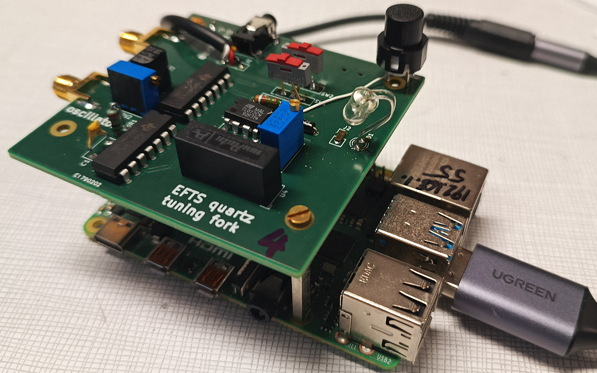

# <a href="https://efts.eu">European Frequency and Time Seminar (EFTS)</a> quartz tuning fork laboratory session.

A quartz tuning fork packaged in a transparent casing is used to demonstrate
* closed loop oscillation using a Negative Impedance Converter (NIC) circuit (<a href="oscillator/oscillateur_1night.png">Allan deviation</a> below $10^{-9}$ up to 30 s integration time).
* openloop stroboscopic imaging of the quartz prong motion driven by sound card output.

<a href=kicad/>KiCAD</a> board design files.

## References:

### Hardware (using a <a href="stroboscopy/IMG_20260409_120540_544.jpg">Raspberry Pi5</a> single board computer for running GNU Radio for controlling the sound card and recording the video stream):
* 32768 Hz tuning fork in transparent package: <a href="https://eu.mouser.com/ProductDetail/Epson-Timing/FC-135-32.7680KA-AC5?qs=f9yNj16SXrLM6nHs1T34rQ%3D%3D">Epson FC-135 32.7680KA-AC5</a> (0.404 euros/p)
* sound card with sampling rate 96 kHz or higher, e.g. <a href="https://www.amazon.fr/-/en/UGREEN-External-Headphones-Compatible-Raspberry/dp/B08Y8CZB2S/">UGREEN (10.2 euros on amazon)</a>
* "digital microscope" webcam, e.g. <a href="https://amscope.co.uk/products/c-hhd510-w">AmScope HHD Series</a> (~50 euros)
* 7414 Schmitt trigger (0.5 to 0.7 euros)
* 7400 NAND gate (0.2 to 0.3 euros)

### Software

* use ``mplayer tv://`` to display the webcam output (or ``vlc`` if it displays properly in the
selected window manager): allows for stretching the image to full screen even if recording a "poor" 
webcam resolution (640x480) stream from the digital microscope.
* GNU Radio <a href="stroboscopy/snd.grc">flowchart</a> for driving the two channels of the
stereo sound card (tested with GNU Radio 3.10) with 1 Hz offset between the signal driving
the tuning fork and the stroboscopic signal driving the LED.
* Maybe wise to ``echo "performance" > /sys/devices/system/cpu/cpu0/cpufreq/scaling_governor`` 
to run the CPUs at maximum speed (will heat to 65 degC).

## Resources:

Equivalent BvD model of the quartz tuning fork (see <a href="KeysightE4990A/">the impedance analyzer</a> measurement):
* R1=53727 $\Omega$
* L1=7221 H
* C1=3.268 fF
* C0=3.368 pF

Quality factor $Q=\frac{1}{R1}\sqrt{\frac{L1}{C1}}=27700$

Resonance frequency $f=\frac{1}{2\pi\sqrt{L1\cdot C1}}=\frac{1}{2\pi\sqrt{7221\times 3.268\cdot 10^{-15}}}=32763$ Hz

