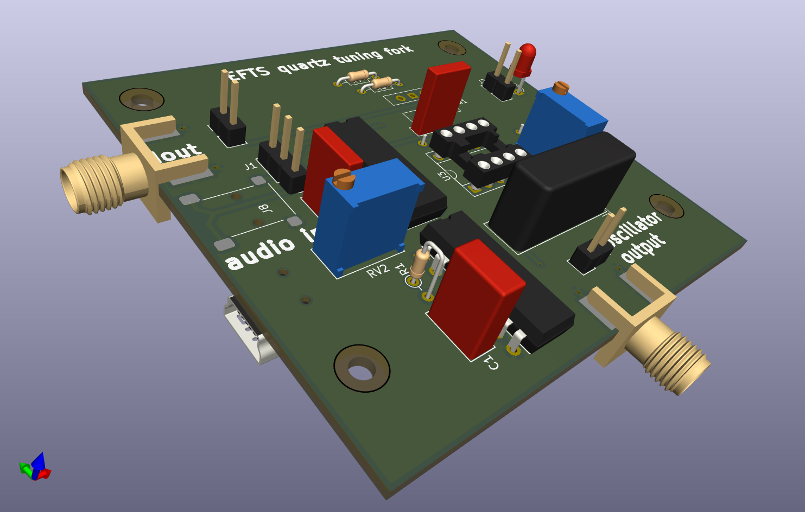

KiCAD schematic and board design files.

The non-plated through holes have been placed with a spacing compatible with
installing the board on top of a Raspberry Pi 4/5 single board computer for
a compact setup. Whether the heat dissipated by the processor will affect
the resonator performance remains to be demonstrated.

