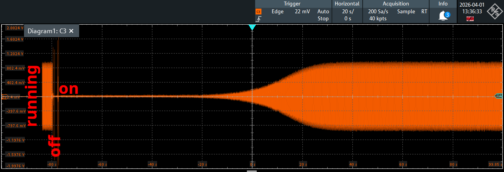
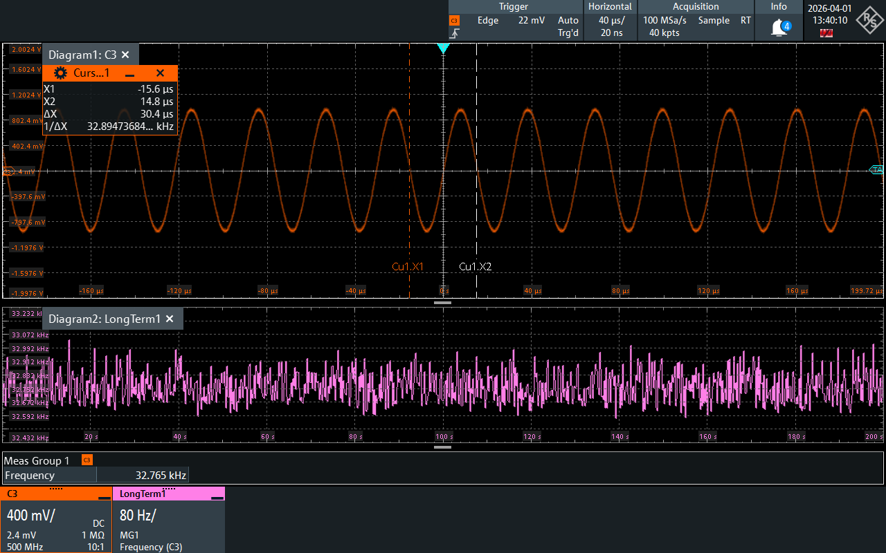
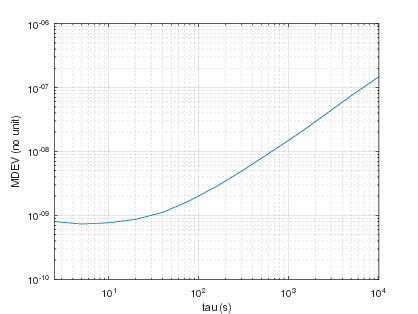
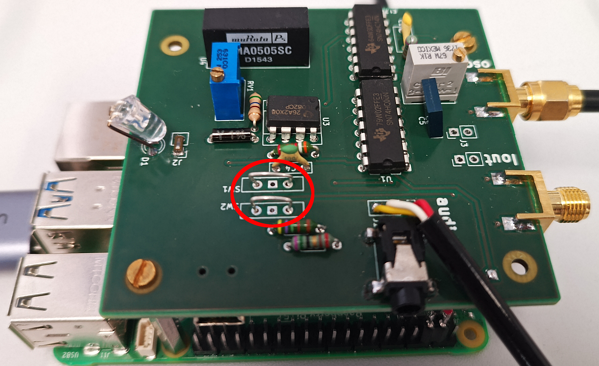
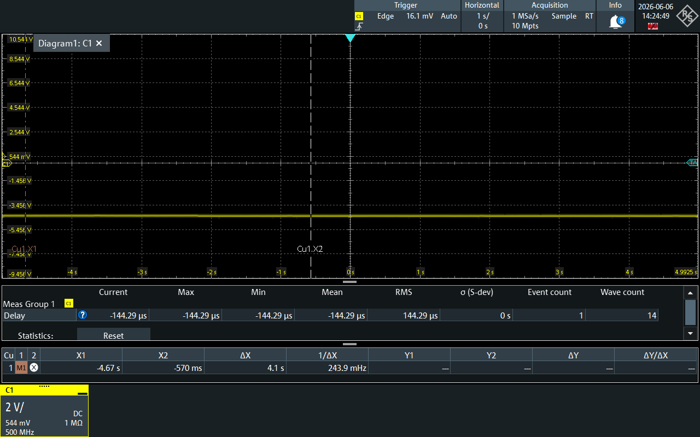
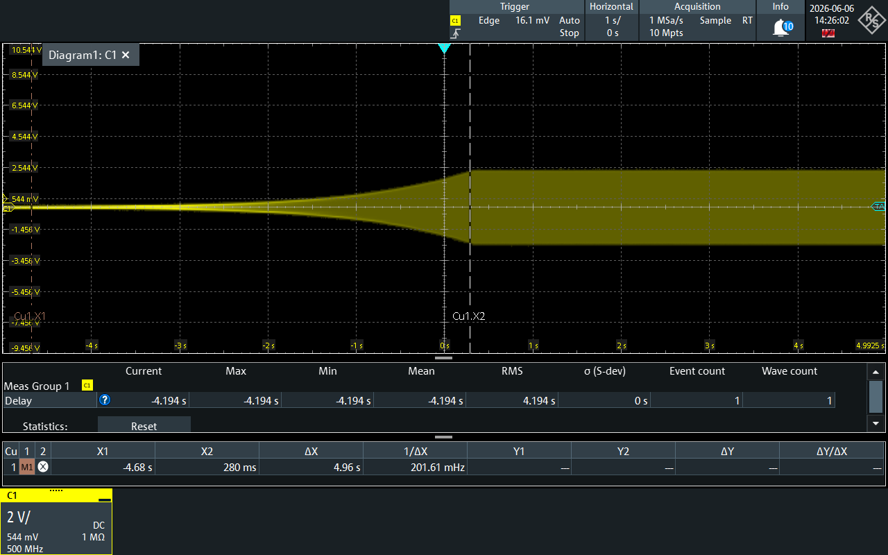
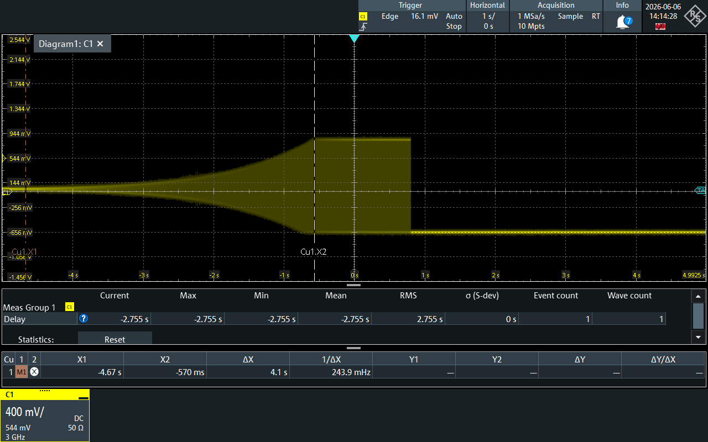

See http://jmfriedt.free.fr/08520429.pdf for the description of the negative impedance circuit (Fig.3, page 7 of the PDF)
even though here any operational amplifier (e.g. TL72, TL82) will allow the 32768 Hz oscillator to start.

# Closed loop oscillator circuit

The startup time can be as long as a few minutes (hundreds of seconds).

The modified Allan deviation of the frequency recording over one night
exhibits a sub- $10^{-9}$ relative frequency instability up to 30 second
integration time.

## Setup

C4 was fitted with a 1 nF capacitor. In case the oscillator fails to start even at
the highest potentiometer value, remove C4.

* Close SW1 pin 2 and 3 to connect the tuning fork to the negative impedance converter circuit.

* Adjust RV1 until the voltage on the Oscillator output SMA jumps from -4V to 0V by decreasing
the potentiometer resistance (turning counter-clock wise).

* Once the voltage is settled on 0V, increase the resistance (turn clock-wise) until the
oscillator starts.

In the following test (operational amplifier output connected to 50 ohms oscilloscope
channel) the oscillator returned to the -4V fixed value:

## Oscillator startup time

The oscillator starts by amplifying thermal noise until the non-linear (saturation) behaviour of the amplifier compensating
the resonator losses is reached, preventing further amplitude growth.
1. the thermal noise in the resonator bandwidth is $\sqrt{R1.k_B.T.B}$ with $R1=53727 ohms and $B$ the resonator bandwidth $f0/Q\simeq 1$ Hz
so that the initial thermal voltage noise is 15 nV
2. the final amplitude is 1 V (see screenshots) reached by an exponential growth $\exp(t/\tau)$ with $\tau=Q/(\pi f0)\simeq 0.3$ s: $-ln(15e-9)=18$ so the startup time constant is about 6 seconds
3. the resonator $R1$ is compensated for by the NIC negative impedance $-RN$ and oscillation occurs if $|RN|<R1$. Stating $GN=1/RN$ and $G1=1/R1$, the excess gain is $GN-GP$ and the startup time is scaled by $G1/(GN-G1)$ which can become significant if $GN-G1\rightarrow 0$
