# Experimental setup: adjusting the LED position to illuminate the tuning fork

## Preliminary tests 
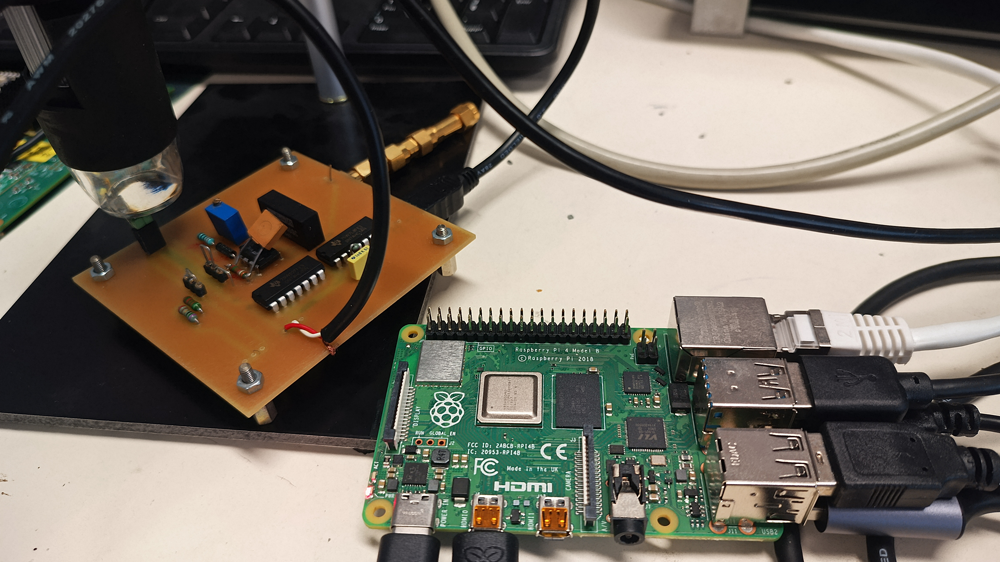

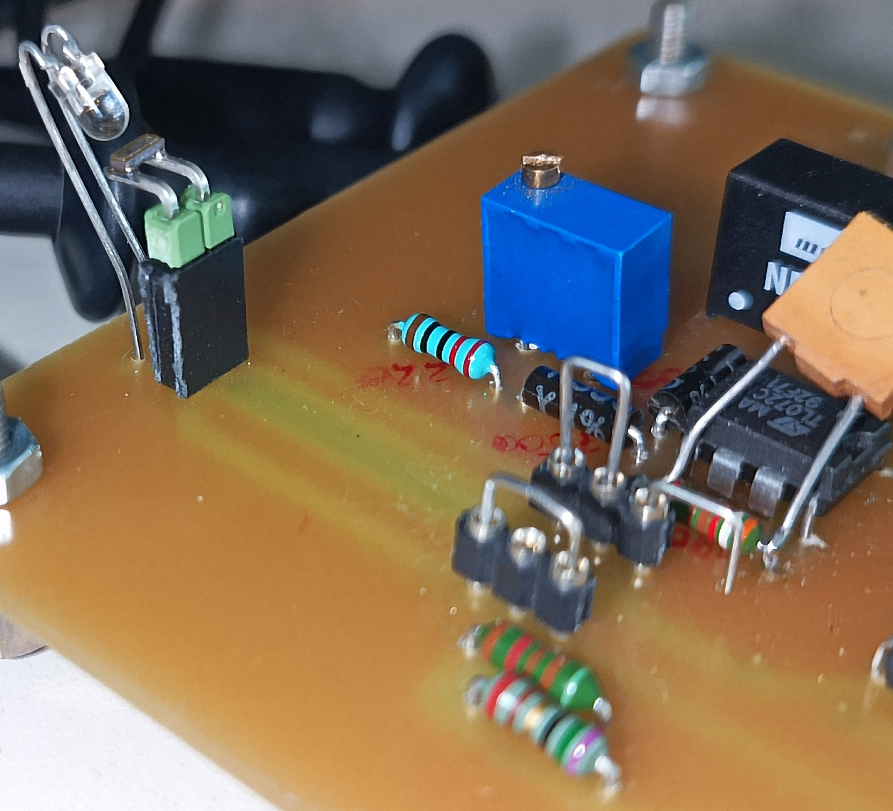

## Oscilloscope screenshots: pulse driving the LED

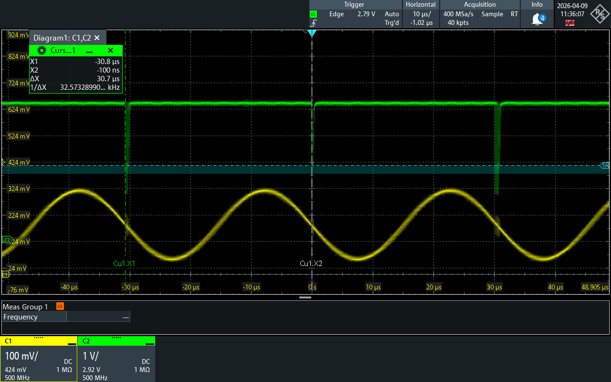

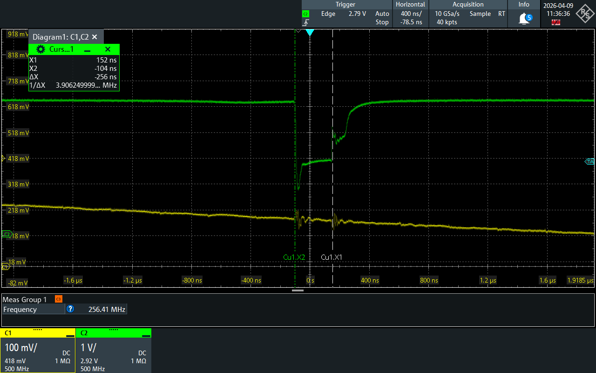

## Final setup

* On the Raspberry Pi: start the graphical user interface (``startx``),
open a terminal and launch ``alsamixer`` to check the sound card setting. Using F6,
select the USB sound card and check that the volume is maximum.

* Quit ``alsamixer`` and launch ``gnuradio-companion`` with the ``snd.grc`` flowgraph.
Select a frequency around 32764 Hz (a few Hz below 32768).

* Connect SPDT SW1 pin 1 to 2 (openloop measurement by driving the
tuning fork with the sound card) and SPDT SW2 1 to 3 (75 ohm load)

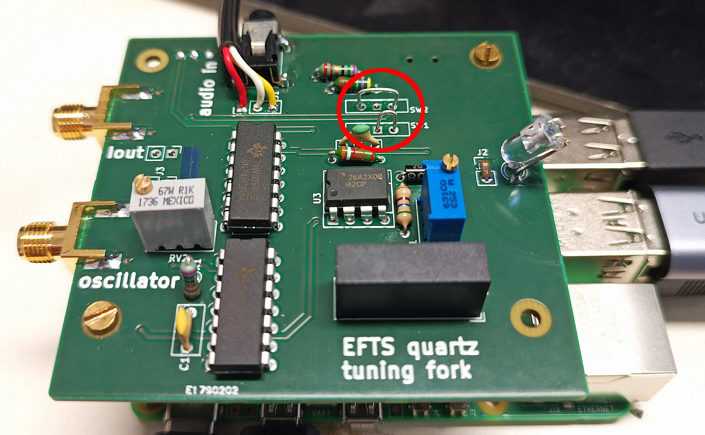

* Adjust the voltage on pin 1 of the 7414 U2A using RV2

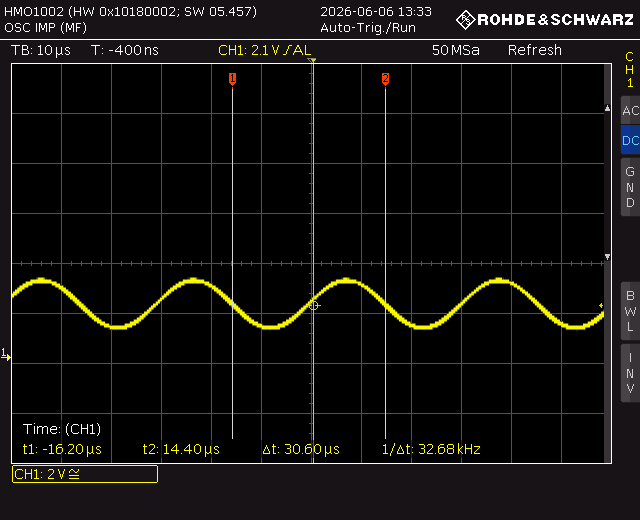

so that its output in pin 2 toggles with
a more or less 50% duty cycle:

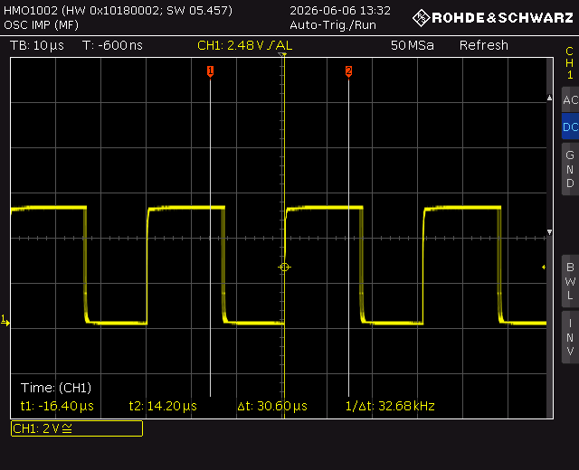

* the voltage driving the LED must be a sharp negative pulse allowing the LED
to illuminate briefly the tuning fork:

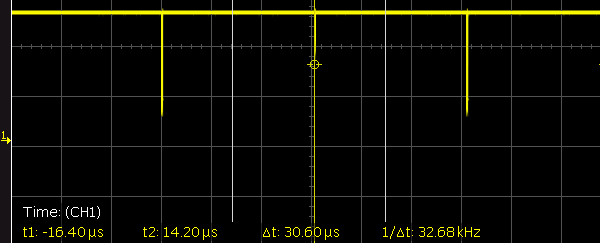
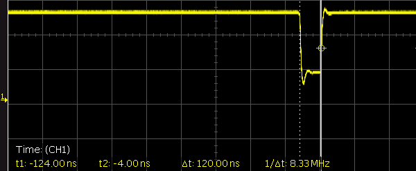

* check that the signal driving the tuning fork reaches the pin closes to the DC-DC
switching supply:

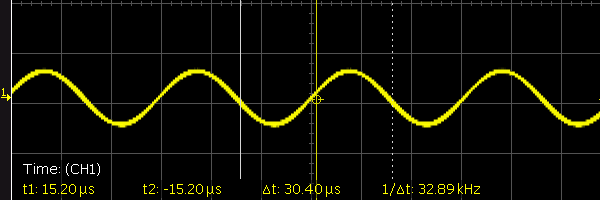

* adjust the microscope position for the tuning fork picture to be centered and sharp

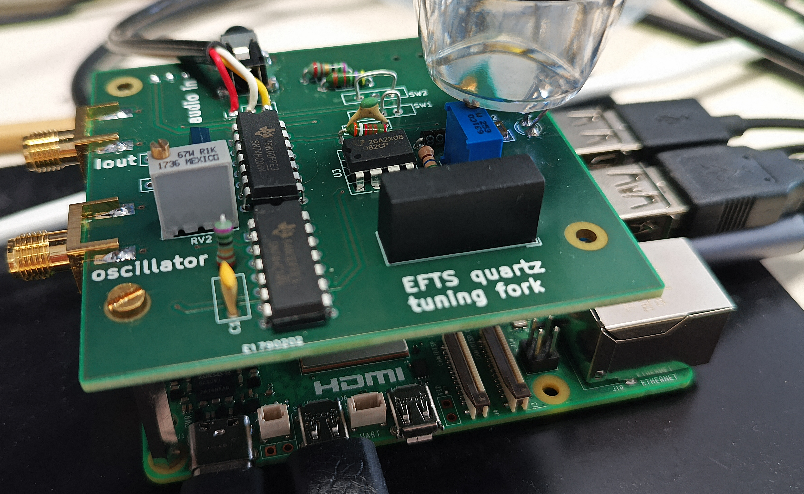

<a href="https://superuser.com/questions/556029/how-do-i-convert-a-video-to-gif-using-ffmpeg-with-reasonable-quality">Converting AVI to animated GIF</a>:

```
ffmpeg -i vlc-record-2026-05-13-09h10m45s-v4l2____dev_video0-.avi -vf "fps=10,scale=320:-1:flags=lanczos,split[s0][s1];[s0]palettegen[p];[s1][p]paletteuse" -loop 0 vlc-record-2026-05-13-09h10m45s-v4l2____dev_video0-.gif
```

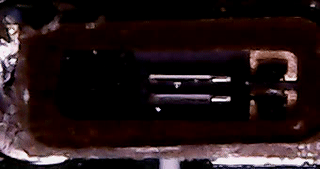

## Automated mechanical displacement amplitude measurement

The script ``analyze.py`` replaces ``mplayer`` or ``vlc`` for collecting and displaying
images, but additionnally analyzes the displacement by correlating a reference measurement
in the first frame with all subsequent frames at the same location, marked with a green
line on each frame. The position and orientation of the green line is hardcoded, so the
tuning fork should be moved until one of the prongs is intersected by the green line. The
position is displayed in the terminal along the amplitude identified as the standard deviation
of a ring buffer collecting the position measurements. Copy-pasting the values displayed in 
the terminal for plotting (e.g. GNU Octave as shown below) allows for recovering the sine-shaped
motion of the prong.

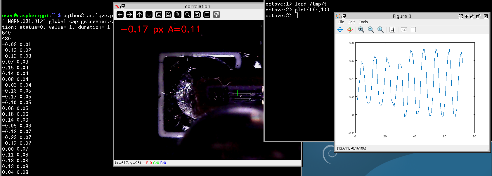

Executing ``analyze.py`` assumes that the package ``python3-opencv`` is installed.

## Problem with the RPi4 USB interface

Running a constant tone at the tuning fork resonance frequency on a Raspberry Pi 4 and
monitoring the current through the 50 kohm resistor between the tuning fork and ground exhibits
some unexpected jumps attributed to unstable signal generation by the sound cart:

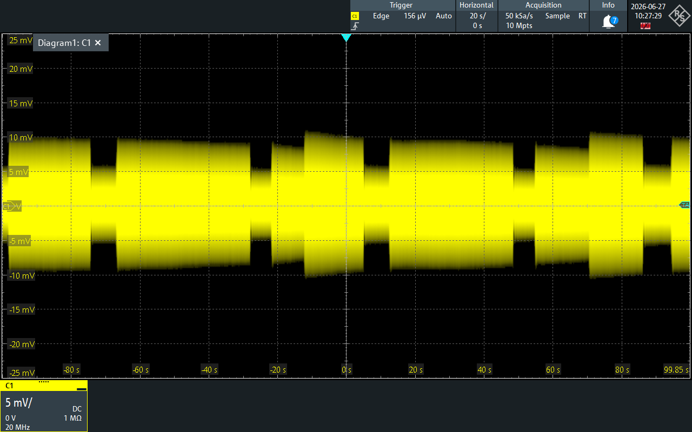

most probably attributed to the poor latency performance of the RPi4 USB.

Same experiment on the Raspberry Pi 5, except at the end (80 s abscissa) when the frequency
was shifted by -2 Hz and back +2Hz to checked that indeed the sound card was probing the 
tuning fork.

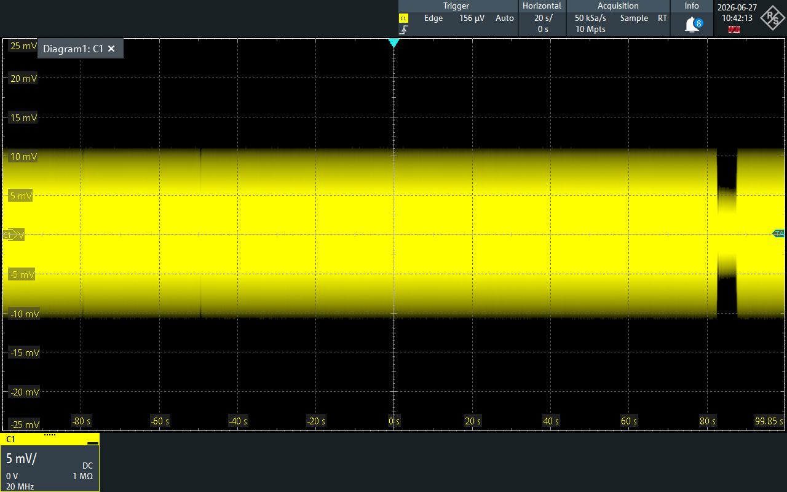
